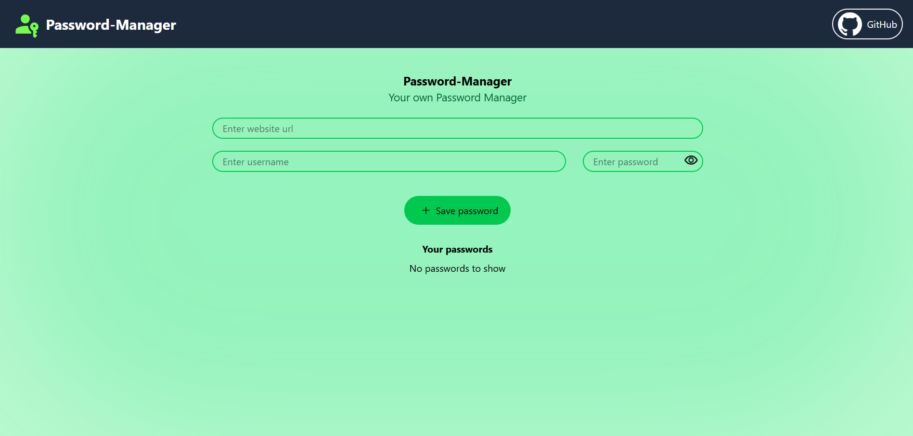

# PassOP - Your Own Password Manager

<p align="center">
  
</p>

PassOP is a sleek and secure web application built with **React** and **Tailwind CSS**. It provides a clean interface for managing your digital credentials, ensuring you never lose a password again.

---

## Features

- **Effortless Management:** Quickly add website URLs, usernames, and passwords through a streamlined interface.
- **Password Toggle:** Securely view or hide your password while typing using the visibility icon.
- **Responsive Design:** A fully fluid layout that works perfectly on mobile, tablet, and desktop screens.
- **Local Storage:** Your data stays with you; credentials are saved locally in your browser for persistent access.
- **Modern UI:** A vibrant, green-themed aesthetic built for clarity and ease of use.

---

## Tech Stack

- **Frontend:** [React.js](https://react.dev/) (Vite)
- **Styling:** [Tailwind CSS](https://tailwindcss.com/)
- **Icons:** React Icons
- **Build Tool:** Vite (Fast HMR)

---

## Getting Started

Follow these steps to set up the project locally:

1. **Clone the repository**
   ```bash
   git clone [https://github.com/YakshJakharia06/Password-Manager.git](https://github.com/YakshJakharia06/Password-Manager.git)
   npm install
   npm run dev
   ```
